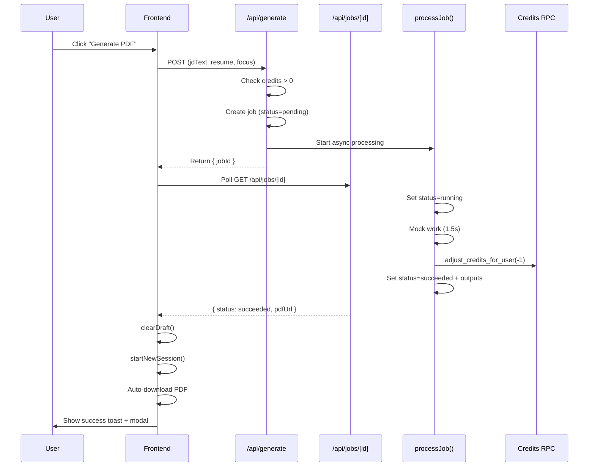

# ATSResumie - Codebase Context

> This document provides comprehensive context about the ATSResumie codebase for LLM assistance.

---

## Project Overview

**ATSResumie** is a Next.js 16 application that helps users optimize their resumes for Applicant Tracking Systems (ATS). Users can:

1. Paste a job description
2. Upload their resume (PDF/DOCX)
3. Get AI-powered analysis and suggestions
4. Download an optimized PDF (after signup)

---

## Tech Stack

| Layer           | Technology                                        |
| --------------- | ------------------------------------------------- |
| Framework       | Next.js 16 (App Router)                           |
| Language        | TypeScript                                        |
| Styling         | Tailwind CSS                                      |
| Database        | Supabase (PostgreSQL)                             |
| Storage         | Supabase Storage                                  |
| Auth            | **Supabase Auth** (Email/Password + Google OAuth) |
| Edge Functions  | Deno (Supabase Edge Functions)                    |
| Package Manager | pnpm                                              |

---

## Directory Structure

```
atsresumie/
├── app/                    # Next.js App Router
│   ├── api/               # API Routes
│   │   ├── analyze/       # ATS analysis endpoint
│   │   ├── credits/       # Get user credits
│   │   ├── export/        # PDF export endpoint (deprecated - use generate)
│   │   ├── generate/      # Create generation job
│   │   ├── jobs/[id]/     # Job status polling
│   │   └── onboarding/    # Anonymous session management
│   │       ├── start/           # Create/resume session
│   │       ├── session-status/  # Get session + draft data
│   │       ├── resume-upload-url/ # Signed URL for upload
│   │       ├── save-draft/      # Save JD + resume metadata
│   │       ├── delete-resume/   # Delete resume from storage
│   │       └── claim/           # Claim session after signup
│   ├── auth/              # Authentication routes
│   │   └── callback/      # OAuth callback handler (PKCE)
│   ├── dashboard/         # User dashboard (placeholder)
│   ├── get-started/       # Main onboarding page
│   ├── layout.tsx         # Root layout
│   ├── page.tsx           # Landing page
│   └── providers.tsx      # React context providers (includes AuthProvider)
│
├── components/
│   ├── auth/              # Authentication components
│   │   └── AuthModal.tsx  # Login/Signup modal with Email + Google
│   ├── get-started/       # Onboarding wizard components
│   │   ├── hooks/         # useResumeForm hook
│   │   ├── steps/         # Step0, Step1, Step2 components
│   │   ├── SignupGateModal.tsx # Export gate (triggers AuthModal)
│   │   ├── SuccessModal.tsx    # Post-generation success modal
│   │   └── ...
│   ├── landing/           # Landing page components
│   │   └── Navbar.tsx     # Navbar with Sign In/Sign Up buttons
│   └── ui/                # shadcn/ui components
│
├── hooks/                 # Global custom hooks
│   ├── useAuth.ts         # Auth state hook
│   ├── useCredits.ts      # Credits state hook
│   └── useJobPolling.ts   # Job status polling hook
│
├── lib/                   # Utility libraries
│   ├── auth/              # Authentication
│   │   ├── auth.ts        # Auth helper functions
│   │   └── AuthContext.tsx # React context provider
│   ├── ats/               # ATS analysis logic
│   │   ├── extractText.ts # PDF/DOCX text extraction
│   │   └── mock.ts        # Mock analysis (placeholder for AI)
│   ├── jobs/
│   │   └── invoke.ts      # Edge function invocation
│   ├── onboarding/
│   │   ├── client.ts      # Client-side API helpers
│   │   └── cookie.ts      # Session cookie management
│   ├── storage/
│   │   └── draft.ts       # localStorage draft backup
│   ├── supabase/
│   │   ├── admin.ts       # Service role client
│   │   ├── browser.ts     # Browser client
│   │   └── server.ts      # Server component client
│   └── utils/
│       ├── hash.ts        # SHA-256 hashing
│       └── sanitize.ts    # Filename sanitization
│
├── middleware.ts          # Supabase session refresh
│
├── supabase/
│   └── functions/         # Deno Edge Functions
│       ├── deno.json      # Deno configuration
│       └── process-generation-job/  # PDF generation worker
│
├── docs/                  # Documentation
│   ├── AUTH.md            # Authentication changelog
│   ├── CONTEXT.md         # This file
│   ├── ONBOARDING.md      # Onboarding flow details
│   └── IMPLEMENTATIONS.md # Implementation history
│
└── public/                # Static assets
```

---

## Authentication System

### Overview

Uses **Supabase Auth** with two methods:

- Email/Password signup and signin
- Google OAuth (Sign in with Google)

### Auth Flow

```
User clicks Login/Signup → AuthModal opens → Email/Password OR Google OAuth
                                                      ↓
                              Supabase handles auth → Session created
                                                      ↓
                              onAuthStateChange → AuthContext updates → UI reflects
```

### Key Files

| File                            | Purpose                                                             |
| ------------------------------- | ------------------------------------------------------------------- |
| `lib/auth/auth.ts`              | `signUpWithEmail`, `signInWithEmail`, `signInWithGoogle`, `signOut` |
| `lib/auth/AuthContext.tsx`      | React context with `onAuthStateChange` listener                     |
| `hooks/useAuth.ts`              | Returns `{ user, isAuthenticated, signIn, signUp, signOut }`        |
| `middleware.ts`                 | Refreshes session token on each request                             |
| `app/auth/callback/route.ts`    | PKCE code exchange for OAuth                                        |
| `components/auth/AuthModal.tsx` | Login/Signup UI with tabs                                           |

### Usage in Components

```typescript
import { useAuth } from "@/hooks/useAuth";

function MyComponent() {
  const { user, isAuthenticated, isLoading, signOut } = useAuth();

  if (isLoading) return <Loading />;
  if (!isAuthenticated) return <LoginPrompt />;
  return <AuthenticatedContent user={user} />;
}
```

### Navbar Auth State

- **Not authenticated:** Shows "Sign in" and "Sign up" buttons
- **Authenticated:** Shows user email prefix and "Sign out" button

### PDF Export Gate

When user clicks "Download PDF":

1. Check `isAuthenticated` from `useAuth()`
2. If not authenticated → Show `SignupGateModal` → Opens `AuthModal`
3. If authenticated → Claim session → Call `/api/export`

---

## Database Schema

### onboarding_sessions

| Column         | Type      | Description               |
| -------------- | --------- | ------------------------- |
| id             | uuid      | Primary key               |
| ip_hash        | text      | Hashed IP for analytics   |
| user_agent     | text      | Browser user agent        |
| user_id        | uuid      | Linked user (after claim) |
| status         | text      | active/claimed/expired    |
| expires_at     | timestamp | Session expiration        |
| **claimed_at** | timestamp | When session was claimed  |

### onboarding_drafts

| Column                   | Type | Description               |
| ------------------------ | ---- | ------------------------- |
| id                       | uuid | Primary key               |
| session_id               | uuid | FK to onboarding_sessions |
| jd_text                  | text | Job description text      |
| resume_bucket            | text | Storage bucket name       |
| resume_object_path       | text | Storage object path       |
| resume_original_filename | text | User's filename           |

### generation_jobs

| Column             | Type      | Description                      |
| ------------------ | --------- | -------------------------------- |
| id                 | uuid      | Primary key                      |
| user_id            | uuid      | FK to auth.users                 |
| parent_job_id      | uuid      | For retry grouping               |
| jd_text            | text      | Job description                  |
| resume_object_path | text      | Resume storage path              |
| focus_prompt       | text      | Optional focus instructions      |
| status             | text      | pending/running/succeeded/failed |
| error_message      | text      | Failure reason                   |
| latex_text         | text      | Generated LaTeX                  |
| pdf_url            | text      | Generated PDF URL                |
| created_at         | timestamp | Job creation                     |
| updated_at         | timestamp | Last update                      |
| started_at         | timestamp | When processing began            |
| completed_at       | timestamp | When job finished                |

### Database Functions (RPC)

```sql
claim_onboarding_session(p_session_id UUID)
-- Links anonymous session to authenticated user
-- Sets status='claimed', user_id=auth.uid()

get_credits()
-- Returns current user's credit balance

adjust_credits(p_delta, p_reason, p_source)
-- Atomic credit mutation (for current user)

adjust_credits_for_user(p_user_id, p_delta, p_reason, p_source)
-- Admin credit adjustment with explicit user_id

update_job_status(p_job_id, p_status, p_latex_text, p_pdf_url, p_error_message)
-- Server-controlled job status updates (SECURITY DEFINER)
```

### user_profiles

| Column     | Type      | Description                 |
| ---------- | --------- | --------------------------- |
| id         | uuid      | PK, references auth.users   |
| credits    | integer   | Current balance (default 0) |
| created_at | timestamp | Profile creation            |
| updated_at | timestamp | Last update                 |

---

## API Endpoints

### Authentication

| Endpoint         | Method | Description                                |
| ---------------- | ------ | ------------------------------------------ |
| `/auth/callback` | GET    | OAuth callback, exchanges code for session |

### Onboarding

| Endpoint                            | Method | Description                |
| ----------------------------------- | ------ | -------------------------- |
| `/api/onboarding/start`             | POST   | Create/resume session      |
| `/api/onboarding/session-status`    | GET    | Get session + draft        |
| `/api/onboarding/resume-upload-url` | POST   | Get signed upload URL      |
| `/api/onboarding/save-draft`        | POST   | Save JD + resume metadata  |
| `/api/onboarding/delete-resume`     | DELETE | Delete resume              |
| `/api/onboarding/claim`             | POST   | Link to authenticated user |

### Analysis & Export

| Endpoint         | Method | Description                                     |
| ---------------- | ------ | ----------------------------------------------- |
| `/api/analyze`   | POST   | Run ATS analysis (supports stored resume)       |
| `/api/generate`  | POST   | Create generation job (requires auth + credits) |
| `/api/export`    | POST   | **Deprecated** - Use `/api/generate` instead    |
| `/api/credits`   | GET    | Get user's remaining credits                    |
| `/api/jobs/[id]` | GET    | Poll job status and outputs                     |

---

## useResumeForm Hook

**Location:** `components/get-started/hooks/useResumeForm.ts`

Central state management for the onboarding wizard.

**Key Exports:**

```typescript
{
  // Navigation
  step, setStep,
  mode, setMode,

  // Form state
  jobDescription, setJobDescription,
  resumeFile, setResumeFile,
  focusPrompt, setFocusPrompt,

  // Analysis
  isAnalyzing, analysis,
  canAnalyze,           // JD length >50 && has resume
  runAnalyze,           // Triggers /api/analyze

  // Export/Generation
  showGate, setShowGate,
  isExporting, exportResult,
  exportPdf,            // Creates job, polls status, auto-downloads PDF

  // Success Modal
  showSuccessModal, setShowSuccessModal,
  handleCreateAnother,  // Resets form + starts new session

  // Session
  sessionId, isLoadingSession, isSessionLocked,
  hasPreviousDraft, previousResumeFilename,
  clearUploadedResume, startFreshSession,
}
```

**canAnalyze Logic:**

```typescript
const hasResumeForAnalysis = resumeFile !== null || uploadedResume !== null;
const canAnalyze =
	jobDescription.trim().length > 50 && hasResumeForAnalysis && !isAnalyzing;
```

---

## Current Implementation Status

### Implemented ✅

**Core Features:**

- Anonymous onboarding flow with session management
- Resume upload to Supabase Storage
- Draft saving and retrieval (localStorage + database)
- Mock ATS analysis (with stored resume support)
- Supabase Auth (Email/Password + Google OAuth)
- AuthModal with Sign In/Sign Up tabs
- Navbar auth buttons with user menu
- Middleware for session refresh

**Credits System:**

- 3 free credits on signup (via trigger)
- Server-side credit checks and mutations
- Credits badge in TopNav (color-coded)
- Atomic credit decrement on successful generation
- `get_credits()` and `adjust_credits()` RPCs

**Generation Job System:**

- Job-based lifecycle (pending → running → succeeded/failed)
- Database table with RLS policies
- POST `/api/generate` - Creates job, returns jobId
- GET `/api/jobs/[id]` - Poll status endpoint
- Job status polling with frontend hook
- Mock processing (1.5s delay)
- Credits decrement ONLY on success

**Session Management:**

- Auto-renew expired sessions for authenticated users
- Auto-start new session after successful generation
- Clear claimed session data from localStorage
- Skip draft restoration for claimed sessions

**UX Enhancements:**

- Success modal with "Create Another" and "Dashboard" options
- Auto-download PDF on generation success
- Success toast notification
- Clean form reset after export

### Placeholder/TODO 🚧

- **Real Claude API integration** for resume generation
- **LaTeX compiler** for PDF creation
- Real PDF upload to Supabase Storage (currently mock URL)
- Email verification flow UI
- Stripe integration for credit purchases
- Email notifications
- User dashboard with generation history

---

## Supabase Setup Required

### Google Cloud Console

- Authorized redirect URI: `https://<project-ref>.supabase.co/auth/v1/callback`

### Supabase Dashboard

1. **Authentication → Providers → Google:** Enable + add Client ID/Secret
2. **Authentication → URL Configuration:**
    - Site URL: `http://localhost:3000`
    - Redirect URLs: `http://localhost:3000/auth/callback`

---

## Generation Flow



---

_Last updated: 2026-01-22_
